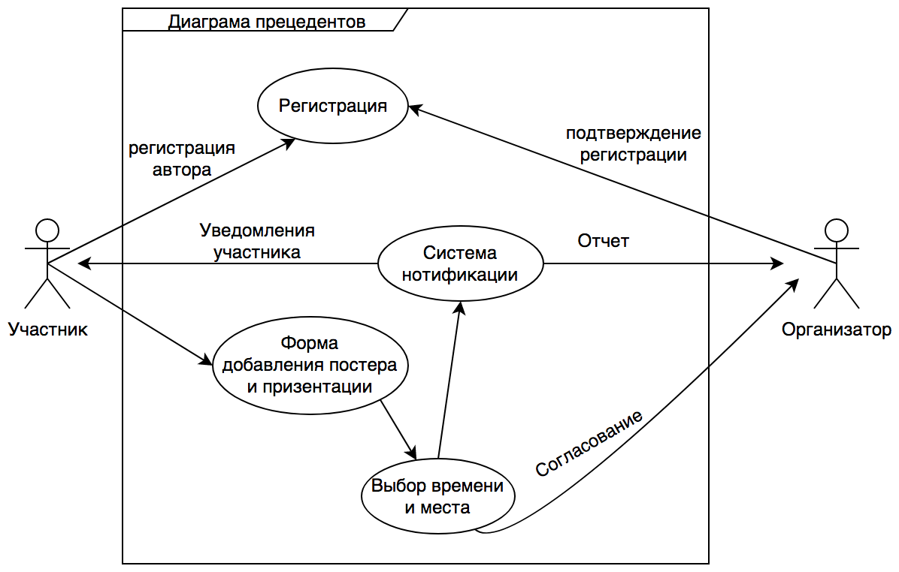

# Результаты выполнения задания

## Диаграмма прецедентов

## Диаграмма последовательности

## Ответы на вопросы

1. Каких бы вы привлекли специалистов для решения этой задачи?
- Программист iOS
- Программист Android
- Web программист
- Back-end программист
- Дизайнер
- Главный разработчик

2. Как организовали бы работу в команде (роли, сроки)?
- Формирование ТЗ
- Прототип
- Юзабилити тестирование
- Утверждение конечных требований
- Разработка
  - iOS
  - Android
  - Web
  - Back-end
- Тестирование
- Устранение недостатков
- Поддержка

Срок разработки - месяц.

3. Предположим вы решили использовать методологию scrum.  Создайте список задач на первые несколько спринтов.

1 спринт:
- Формирование ТЗ
- Выбор технологий
- Прототипирование

2 спринт:
- Дизайн приложений
- Активная разработка

3 спринт:
- Тестирование
- Доработка

4 спринт:
- Доработка
- Подготовка документации для дальнейшей поддержки
